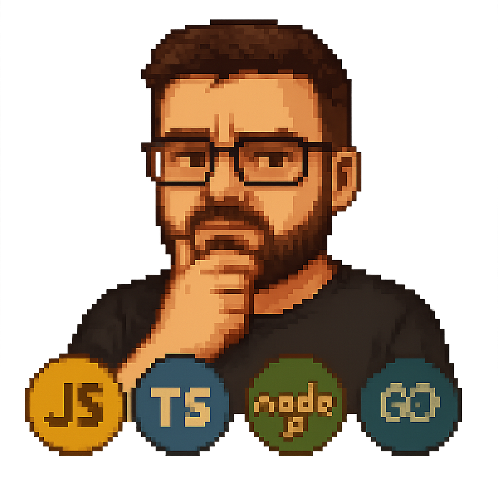

# 🎮 Meu Portfolio Gamificado

Bem-vindo ao **Meu Portfolio Gamificado**! Este projeto é uma experiência visual inspirada em pixel-art e estética de jogos retrô, com um toque moderno graças ao Next.js e Tailwind CSS.

---

## ✨ Temática & Estilo

- **Fontes:**
  - Pixelada: `"Press Start 2P", monospace`
  - Moderna: `"Inter", sans-serif`
- **Cores do Tema:**
  - Fundo escuro: `#2F283A`
  - Texto claro: `#E0D8E8`
  - Primária: `#8E60D1`
  - Secundária: `#60D18E`
  - Acento: `#D1BE60`
  - Bordas: `#1E1A24`
- **Sombras Pixeladas:**
  - `--shadow-pixel-sm: 2px 2px 0px 0px var(--color-game-border);`
  - `--shadow-pixel-md: 4px 4px 0px 0px var(--color-game-border);`

---

## 🖥️ Efeitos Visuais

- **CRT Effect:**
  - Simula linhas e distorção de monitores antigos para um clima nostálgico.
- **Barra de Rolagem Customizada:**
  - Scrollbar estilizada com cores do tema e bordas pixeladas.

---

## 🚀 Como Rodar

```bash
npm install
npm run dev
```

Abra [http://localhost:3000](http://localhost:3000) para ver o resultado.

---

## 🛠️ Tecnologias

- [Next.js](https://nextjs.org/) 14+
- [React](https://react.dev/)
- [Tailwind CSS](https://tailwindcss.com/)

---

## 🎨 Customização

Você pode alterar facilmente as cores, fontes e efeitos editando o arquivo [`src/app/globals.css`](src/app/globals.css).

---

## 📦 Estrutura

- `src/app/` — Páginas e layouts principais
- `src/data/` — Dados do portfólio
- `src/images/` — Imagens e avatares

---

## 👾 Sobre

Projeto criado por Danton Tomacheski. Sinta-se à vontade para explorar, contribuir ou se inspirar!

---

> "A estética retrô não é apenas visual, é uma experiência!"

---

[](https://github.com/DantonTomacheski/portifolio)
